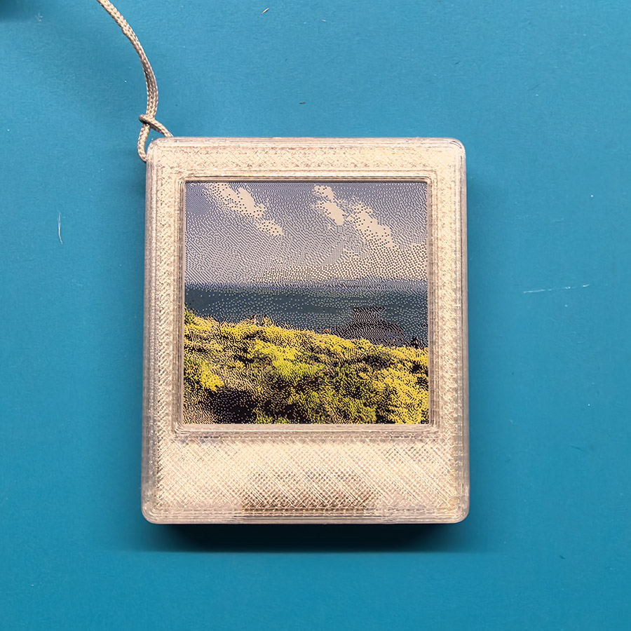
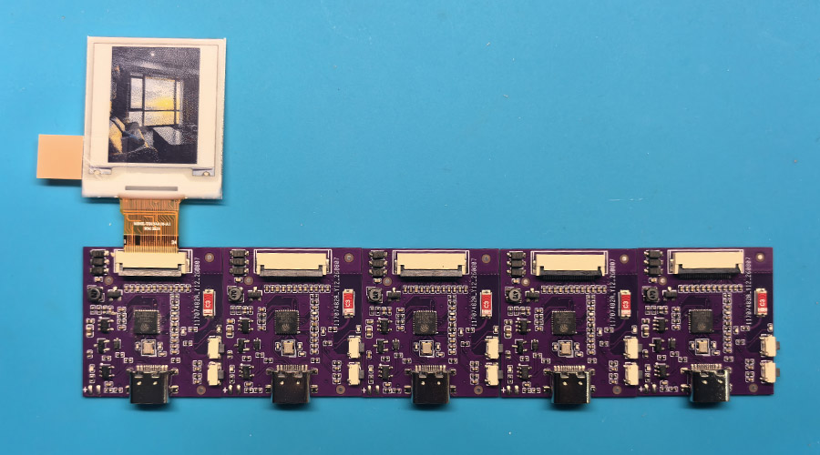
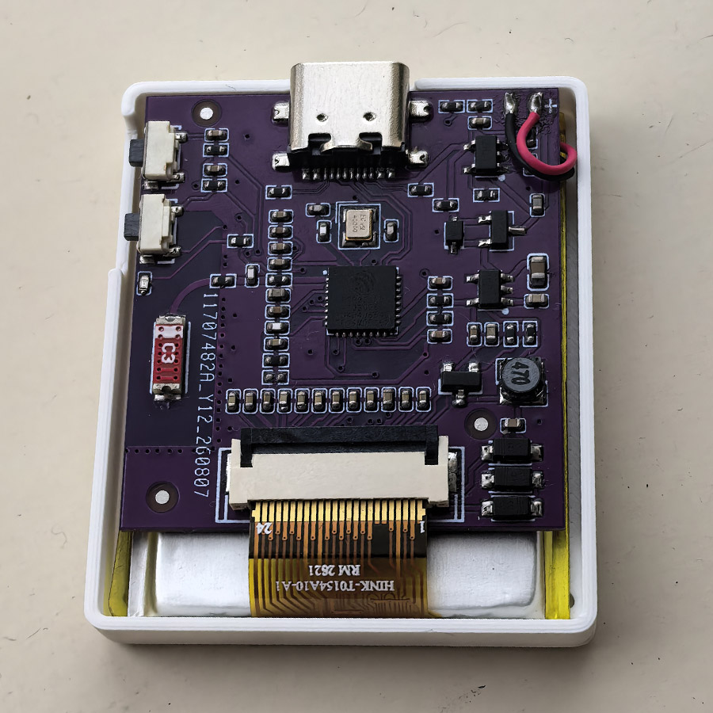

# MiniEink

**ESP32-C3 墨水屏设备固件** · 多屏适配 · Lua 模块化 · BLE 配置 · 深度休眠异步刷屏

> **English TL;DR** — Firmware for a small ESP32-C3 e-paper gadget. It drives three 1.54"
> panels (4-color 200x200 / 6-color 240x240 / black-white 200x200 SSD1681 with partial
> refresh), is configured over BLE from a WeChat mini program, runs user-installed Lua
> modules (gallery, quotes, countdown, calendar, tarot, ...), and uses a deep-sleep-first
> power model: the MCU issues the refresh command and sleeps immediately, waking only to
> power the panel down.

 
 
 

---

## 目录

- [1. 项目简介](#1-项目简介)
- [2. 特性](#2-特性)
- [3. 硬件](#3-硬件)
- [4. 目录结构](#4-目录结构)
- [5. 快速开始](#5-快速开始)
- [6. 使用说明](#6-使用说明)
- [7. Lua 模块开发](#7-lua-模块开发)
- [8. 省电设计](#8-省电设计)
- [9. 分区表](#9-分区表)
- [10. 已知限制](#10-已知限制)
- [11. 第三方组件与许可](#11-第三方组件与许可)
- [12. 相关文档](#12-相关文档)
- [免责声明](#免责声明)
- [License](#license)

---

## 1. 项目简介

MiniEink 是一个基于 ESP32-C3 的多色墨水屏设备。设备平时处于**深度休眠**，休眠电流28uA，异步刷屏非常省电，靠按键或定时唤醒。所有交互（切换模块/条目、安装模块、改配置、上传图片）都通过 **BLE** 由微信小程序完成。

本项目包含设备源码/外壳3D设计和硬件设计全部开源文件。

## 2. 特性

**硬件**

- 外观尺寸：43\*36\*8.5mm
- 续航：200mA，休眠28uA，每次刷新40uA，每小时刷新一次，可续航4个月左右

**屏幕**

- 一套代码支持三种 1.54" 墨水屏，靠一个宏切换（见 3.2）
- 统一的显示接口：初始化、整帧刷新、刷白
- **异步刷屏**：发完刷新命令立即深度休眠，刷新结束后定时唤醒补断电——刷新期间的 MCU 电流从约 18 mA 降到接近 0
- **黑白屏局部刷新**：面板比对上一帧只驱动变化像素，约 0.3 s（全刷约 2s），不整屏闪黑；变化过大或连续局部刷到上限时自动全刷清残影
- **4色/6色屏刷新**：4色屏刷新约12秒，6色屏刷新约26秒
- 内置 GB2312 全量点阵字库（16x16 / 24x24），Lua 侧可直接显示中文

**系统**

- 模块化：内置相册 + 动态 **Lua 模块**，模块可启用/禁用、按键切换、定时唤醒刷新
- 统一休眠模型：任何模块执行完即休眠，没有常驻 `loop`，功耗可预期
- BLE 配置（NimBLE）：状态查询、模块安装、配置读写、图片上传/下载、校时
- 相册：图片存 SPIFFS，支持显示方向、循环播放、按键手动翻页
- 电池检测与低压保护（< 3.1 V 直接休眠）
- 省电细节：日常深度休眠、tickless idle / light sleep、BLE 断开即休眠、PWM 指示灯

## 3. 硬件

### 3.0 硬件制作注意事项

- Gerber.rar为已验证项目，直接打样即可，PCB厚度0.8mm
- 工程文件修改PCB挖空TypeC区域使用了TypeC沉板接口设计，厚度进一步降低0.8mm，但未作打样验证
- 如果使用6色屏请不要焊接R18电阻
- 参考上述图片组装硬件，最后胶水粘合上下外壳

### 3.1 规格与引脚

| 项目 | 规格 |
|------|------|
| 主控 | ESP32-C3（4 MB Flash，无 PSRAM） |
| 屏幕 | 1.54" 墨水屏，三种可选（见 3.2） |
| 按键 | KEY_UP / KEY_DOWN，低电平有效，可从深度休眠唤醒 |
| 指示灯 | 蓝色蓝牙开启 LED |
| 电池 | 3.85V 高压锂电，充满4.35V，ADC 分压采样（分压系数 2），< 3.1 V 保护性休眠 |
| 通信 | BLE 5（NimBLE-Arduino） |

| 信号 | GPIO |
|------|------|
| KEY_UP | 1 |
| KEY_DOWN | 2 |
| 电池 ADC | 0（ADC1_CH0） |
| EPD BUSY | 10 |
| EPD RST | 3 |
| EPD DC | 4 |
| EPD CS | 5 |
| EPD SCK | 6 |
| EPD MOSI | 7 |
| 蓝色 LED | 20 |

三种屏共用同一组 EPD 引脚，换屏只需改 `include/common.h` 的宏。

### 3.2 屏幕型号

| 型号 | 宏（`include/common.h`） | 分辨率 / 色深 | 帧大小 | 驱动 |
|------|--------------------------|---------------|--------|------|
| 4 色（黑白黄红） | 两个宏都不定义 | 200x200 / 2bpp | 10000 B | `eink.cpp` + `Display_EPD_W21*.cpp` |
| 6 色（+蓝绿） | `#define INK6` | 240x240 / 4bpp | 28800 B | `eink6.cpp`（JD7601） |
| 黑白 | `#define INK_BW` | 200x200 / 1bpp | 5000 B | `eink_bw.cpp`（SSD1681，支持局部刷新） |

屏幕色数会通过 BLE 状态的 `ink` 字段上报（6 / 4 / 2），小程序据此选择图片格式。

## 4. 目录结构

```
src/
├── main.cpp              # 入口：按键扫描、唤醒判定、主循环
├── sleep_manager.cpp     # 深度休眠：唤醒源（按键/定时）与定时器配置
├── epd_async.cpp         # 异步刷屏调度：刷新中标记、补断电、兜底断电
├── eink.cpp / eink6.cpp / eink_bw.cpp   # 4 色 / 6 色 / 黑白屏驱动
├── Display_EPD_W21*.cpp  # 4 色屏底层时序
├── GUI/                  # GUI_Paint 绘图库（Scale 2/4/7 对应 1/2/4 bpp）
├── module_registry.cpp   # 模块注册表：内置模块 + 扫描 /spiffs 下的 Lua 模块
├── lua_hardware_api.cpp  # Lua 侧 API：display / time / config / sys
├── gallery.cpp           # 相册模块（列表、显示、旋转、循环）
├── ble_config.cpp        # BLE 服务：状态、配置、模块/图片上传、校时
├── battery.cpp           # 电池 ADC 采样与低压保护
├── cmd_handler.cpp       # 串口调试命令
└── time_calibration.cpp  # RTC 校时与时区保持

include/                  # 头文件（eink_display.h / epd_async.h / common.h ...）
lib/lua-5.4.7/            # Lua 解释器源码
data/                     # 烧录到 SPIFFS（modules 分区）
├── fonts/                # GB2312 16/24 点阵 + Unicode→GB2312 映射表
└── gallery.cfg           # 相册模块的配置定义
docs/LUA_SCRIPT_GUIDE.md  # Lua 模块开发与 API 完整文档
tools/                    # 字库生成、平台补丁等脚本
partitions.csv            # 分区表
platformio.ini            # PlatformIO 工程配置
PROJECT_HANDOFF.md        # 开发手记（中文，含大量实现细节与踩坑记录）
```

## 5. 快速开始

### 5.1 环境要求

- [PlatformIO](https://platformio.org/)（VSCode 插件或 Core CLI 6.x）
- Python 3（PlatformIO 自带；`tools/` 下的字库脚本需要 `Pillow`，仅重新生成字库时用到）
- 一块 ESP32-C3 设备（本项目用 `board = adafruit_qtpy_esp32c3` 作为板级变体，硬件为自定义板）

### 5.2 首次构建：给平台打补丁

工程用 `custom_sdkconfig` 打开电源管理 / tickless idle，pioarduino 平台在该配置下有两处
构建 bug（`lib_ignore = BLE` 会剪掉 IDF 的 bt 组件、库构建子环境读不到 `lib_deps`），
首次构建前先运行补丁脚本（可重复执行、可还原）：

```bash
python tools/pioarduino_patches.py            # 打补丁
python tools/pioarduino_patches.py --dry-run  # 只检查状态
python tools/pioarduino_patches.py --revert   # 还原
```

> 平台版本被 `platformio.ini` 固定在 pioarduino 55.03.38-1；升级平台后若脚本提示文本
> 不匹配，需要按脚本输出手工处理。

### 5.3 编译与烧录

```bash
pio run                        # 编译固件
pio run -t upload              # 烧录固件（USB）
pio run -t uploadfs            # 烧录文件系统：data/ → SPIFFS（modules 分区）
pio device monitor -b 115200   # 串口日志 / 调试命令
```

> 首次编译会按 `custom_sdkconfig` 全量重建 Arduino IDF 库，耗时较长（之后走缓存）。

要点：

- **固件和文件系统都要烧**：字库与配置定义在 `data/`，通过 `uploadfs` 写入 SPIFFS；
  只烧固件会出现中文显示为 `?`、模块没有配置项等问题。
- 修改 `data/` 后重新执行 `uploadfs` 会覆盖整个分区，设备上已上传的模块与相册图片
  请先备份（`pio run -t uploadfs` 不做合并）。
- 设备上运行时上传的模块与图片也都在同一块 SPIFFS 里，见 [第 9 节](#9-分区表)。

### 5.4 中文字库

`data/fonts/` 三个文件在运行时由 `lua_hardware_api.cpp` 直接读取：

| 文件 | 内容 |
|------|------|
| `gb2312_16.bin` | GB2312 全集 16x16 点阵，每字 32 B |
| `gb2312_24.bin` | GB2312 全集 24x24 点阵，每字 72 B |
| `gb2312_map.bin` | Unicode → GB2312 映射表（`[u32 count][count x (u16 u16)]`，按 Unicode 升序） |

重新生成（两个脚本二选一，输出都写到 `data/fonts/`）：

```bash
# A. 用 TTF 字体渲染（可换任意中文字体）
python tools/gen_gb2312_font.py --font C:/Windows/Fonts/NotoSansSC-VF.ttf

# B. 经典 HZK16 / HZK24S 点阵字库转换（源文件需自行准备，未随仓库发布）
python tools/convert_hzk.py tools/fonts/hzk_src/HZK16_ucdos.bin  data/fonts/gb2312_16.bin  32
python tools/convert_hzk.py tools/fonts/hzk_src/HZK24S_ucdos.bin data/fonts/gb2312_24.bin  72
```

## 6. 使用说明

### 6.1 按键

| 按键 | 短按 | 长按（按住 3 秒即触发） |
|------|------|--------------------------|
| KEY_UP | 上一项 | 开/关 BLE 配置模式 |
| KEY_DOWN | 下一项 | 切换到下一个已启用模块 |

设备默认深度休眠，按键可唤醒；唤醒后执行动作即再次休眠（BLE 配置模式除外）。

### 6.2 串口调试命令

| 命令 | 说明 |
|------|------|
| `ver` | 固件版本 + 编译时间 |
| `bat?` | 电池电压（mV） |
| `gettime?` | 当前时间 |
| `lsmod` | 列出已注册模块（类型 / 配置项数 / 是否启用） |
| `lsi` / `ls` | 列出 `/spiffs` / `/extflash` 文件 |
| `read <文件名>` | 打印 `/spiffs/<文件名>` 内容 |
| `rm <文件名>` | 删除 `/spiffs/<文件名>` |
| `dis <文本>` | 在屏幕上显示一段文本（验证屏幕与字库） |
| `white` | 整屏刷白 |
| `probe` | 打印面板 BUSY 电平时间线（适配新屏幕时测刷新时长与空闲极性） |
| `nvs` | 打印 NVS 中的键值 |
| `unbind` | 清除 BLE 绑定并重新生成密码 |
| `dfu` | 重启进入 ROM 下载模式（等同拉低 GPIO0 复位） |

### 6.3 通过 BLE 使用

1. 长按 KEY_UP 进入 BLE 配置模式（蓝色指示灯闪烁），设备以 `MiniEink` 广播；
2. 使用微信小程序*幻彩抽屉*连接；
3. 认证后即可查询状态、读写配置、安装 Lua 模块、上传相册图片；
4. 断开连接后设备立即深度休眠。

## 7. Lua 模块开发

模块 = 一个 `.lua` 脚本 + 可选的同名 `.cfg` 配置定义，放在 data 目录（`/data/<id>.lua`、`/data/<id>.cfg`），并通过上传文件系统命令传输到设备，设备启动时会扫描并注册为模块。
还可通过小程序市场下载安装，在小程序配置页启用/禁用。

```lua
-- @name: 纪念日倒计时
-- @version: 1.0.0
-- @author: your-name
-- @description: 显示距离目标日期的天数
-- @id: countdown

function setup()
  display.clear()
  display.text(10, 20, "距离目标还有", 3, 0)
  display.text(10, 60, "128 天", 4, 3)
  display.show()          -- 异步刷屏：发完刷新命令即可返回
end

-- 按键钩子（可选）：短按 KEY_UP / KEY_DOWN 时调用
function subpage_prev() end
function subpage_next() end
```

要点：

- `setup()` 每次唤醒（定时/按键）都会被调用一次，**画完请调用 `display.show()`**；
  模块的 `loop()` 不会被调用（统一休眠模型），周期刷新用配置项 `interval`
  （分钟，1~1440）交给系统定时唤醒。
- 屏幕尺寸由设备注册为全局量 `WIDTH` / `HEIGHT`（黑白屏与 4 色屏 200，6 色屏 240）。
- 颜色值统一为 `0=黑 1=白 2=黄 3=红 4=蓝 5=绿`；4 色与黑白屏会自动做合理映射
  （黑白屏把黄色映射为浅灰抖动，红/蓝/绿映射为黑）。
- 跨深度休眠的状态用 `sys.set_state()` / `sys.get_state()`（RTC 内存，掉电丢失）。
- 配置项读写用 `config.get()`；键名同时是 NVS 键名，**最长 15 字符**。

完整 API（`display.*` / `time.*` / `config.*` / `sys.*`、中文字库与排版注意事项）见
[`docs/LUA_SCRIPT_GUIDE.md`](docs/LUA_SCRIPT_GUIDE.md)。

配置定义 `.cfg`（决定小程序配置页渲染哪些控件）为 JSON 数组：

```json
[
  {
    "type": "select",
    "key": "interval",
    "label": "自动刷新",
    "options": [
      {"label": "关闭", "value": 0},
      {"label": "6小时", "value": 360}
    ],
    "default": 360
  }
]
```

## 8. 省电设计

**统一休眠模型**：设备没有常驻循环，模块执行完即 `esp_deep_sleep_start()`；唤醒源只有
按键（KEY_UP / KEY_DOWN）与定时器（模块配置的 `interval`）。蓝牙配置模式是唯一例外，
断开连接后立即休眠。

**异步刷屏**（`include/epd_async.h`）：墨水屏刷新由面板自己定时序，MCU 等待毫无意义。
所以流程是：

1. 模块调用 `display.show()` → 驱动发完刷新命令立即返回，并置一个 RTC 标记；
2. `enter_deep_sleep()` 看到该标记：只启用定时唤醒（禁按键唤醒，避免打断刷新），MCU 立刻休眠；
3. 定时唤醒后只做一件事：等刷新结束 → 关面板电源 → 面板深度休眠 → 继续休眠；
4. 若刷完没有休眠（例如 BLE 交互中）：主循环兜底，刷新结束后补一次断电。

| 屏型 | 刷新耗时 | 补断电唤醒窗口 |
|------|---------|----------------|
| 6 色 240x240 | 20~30 s | 30 s |
| 4 色 200x200 | ~13.5 s | 22 s |
| 黑白全刷 | ~2 s | 4 s |
| 黑白局部刷 | ~0.3 s | 1.5 s |

深度休眠期间会 `gpio_hold` 住面板控制引脚（RST / DC / CS / SCK / MOSI），避免引脚浮空
干扰面板；唤醒补断电前先做一次“只复位、不等 BUSY”的复位，保证断电/深睡命令不被忽略。

**局部刷新（黑白屏）**：上一帧缓存在 RTC 内存（5000 B，带 CRC 校验），每次刷新把新帧写
`0x24`、上一帧写 `0x26` 作为基准，然后发 `0x22=0xCF` 局部刷新——面板只驱动有差异的像素。
变化像素超过 25%（`EPD_BW_PARTIAL_MAX_DIRTY_PCT`）或连续局部刷满 10 次
（`EPD_BW_PARTIAL_MAX_RUN`）时自动改走全刷清残影；阈值都在 `include/eink_bw.h`，
可按实测调整。

**其他**：`CONFIG_PM_ENABLE` + tickless idle 让 BLE 广播/等待期间自动进入 light sleep；
BUSY 轮询间隔 ≥ 20 ms 才能让 CPU 睡进 light sleep；指示灯用 1 kHz / 5% PWM 代替常亮。

## 9. 分区表

`partitions.csv`（4 MB Flash）：

| 分区 | 类型 | 偏移 | 大小 | 用途 |
|------|------|------|------|------|
| `nvs` | data/nvs | 0x9000 | 20 KB | 配置、绑定状态、密码 |
| `otadata` | data/ota | 0xE000 | 8 KB | 预留 |
| `app0` | app/ota_0 | 0x10000 | 992 KB | 固件 |
| `modules` | data/spiffs | 0x108000 | 约 3.0 MB | SPIFFS：字库、模块 `.lua/.cfg`、相册图片 |

## 10. 已知限制

- 局部刷新目前只有**黑白屏**支持；4 色与 6 色驱动仍是整屏刷新。
- 换屏幕型号后，相册里旧格式的图片无法显示（设备按字节数校验并拒绝），需要重新上传。
- 局部刷新会积累残影，因此有“每 N 次 / 变化过大自动全刷”的策略，做不到“永不闪屏”。
- 部分面板的 BUSY 引脚在读不到空闲电平（例如 MCU 深睡醒来后一直为低），因此补断电逻辑
  以时间为保证、不依赖 BUSY；`probe` 命令可用于确认某块屏的 BUSY 行为。
- 当前固件只有一个 app 分区，**不支持 OTA**，升级需要重新烧录。

## 11. 第三方组件与许可

| 组件 | 说明 / 许可 |
|------|-------------|
| [Lua 5.4.7](lib/lua-5.4.7) | 源码在 `lib/lua-5.4.7`，MIT |
| [NimBLE-Arduino](https://github.com/h2zero/NimBLE-Arduino) | BLE 栈，Apache-2.0（PlatformIO 依赖） |
| [FastLED](https://github.com/FastLED/FastLED) | PlatformIO 依赖，MIT |
| GUI_Paint / 4 色屏时序 | 面板原厂示例代码（Good Display 系列），保留原貌 |
| 6 色（JD7601）/ 黑白（SSD1681）驱动 | 由面板原厂示例移植（含初始化时序与波形表） |
| `data/fonts/*.bin` | 由经典 HZK16 / HZK24S 点阵字库转换（来源见 `tools/convert_hzk.py`） |

## 12. 相关文档

- [`docs/LUA_SCRIPT_GUIDE.md`](docs/LUA_SCRIPT_GUIDE.md)：Lua 模块开发完整指南
  （模块格式、`display`/`time`/`config`/`sys` API、中文字库与排版注意事项）
- [`PROJECT_HANDOFF.md`](PROJECT_HANDOFF.md)：开发手记，含屏幕适配、省电实测、
  BLE 分块传输、小程序前端交互等实现细节与踩坑记录（中文）
- `python tools/pioarduino_patches.py --dry-run`：检查构建平台补丁状态

## 免责声明

本项目是个人自制的开源固件工程，按“现状”提供，不保证适用于任何特定用途。自行打样、
焊接、连接锂电池时请注意安全（保护板、极性、避免短路），因使用本工程造成的设备损坏或
数据丢失由使用者自行承担。

## License
- 固件代码: GPLv3
- 硬件设计: CC BY-NC-SA 4.0

商业使用需获得作者书面许可。